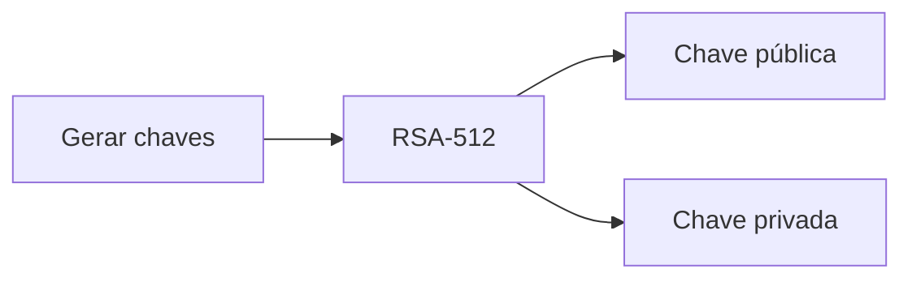
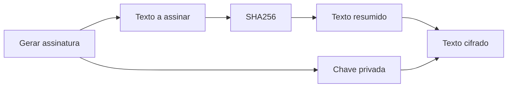
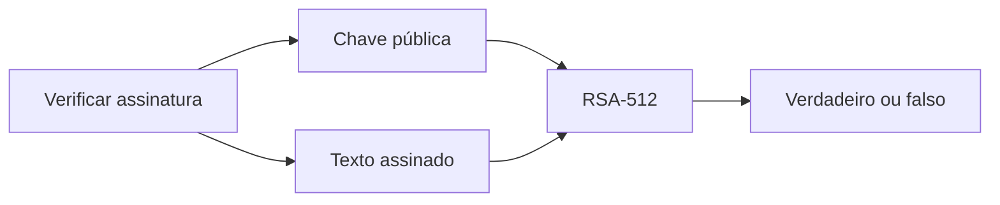
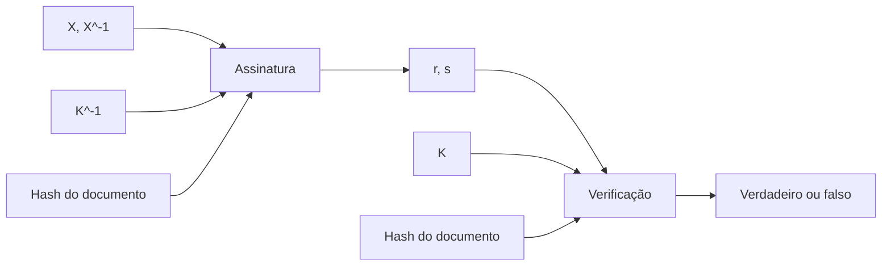

# Aula 7

## Assinatura Digital
As assinaturas digitais permitem, autenticar conteúdos de um documento (integridade), autenticar a origem do documento (autenticidade) e garantir a não repudiação (não negação da autoria).

### Esquema de assinatura digital
Recorrendo a chaves públicas (nomeadamente RSA), são usados **três** algoritmos:

- Algoritmo para gerar chaves: É gerado um par de chaves, uma pública e outra privada;
  - (pub, priv) = RSA(512);

- Algoritmo para gerar assinatura: É calculado o Hash da mensagem e decifrado com a chave privada;
  - Texto Assinado = RSA(priv, SHA256(Mensagem));


- Algoritmo para verificar assinatura: É calculado o Hash da mensagem e decifrado com a chave pública;
  - Verifica = RSA(pub, SHA256(Mensagem)) == Texto Assinado;


A assinatura pode se encontrar:
- No próprio documento (apêndice);
- Noutro documento (i.e. ficheiro PEM);

### Propriedades principais de uma assinatura digital
Estas são as **cinco principais propriedades** de uma assinatura digital:
  - Autenticidade: A mensagem foi assinada pelo dono da chave privada;
  - Autenticação da origem de informação: A assinatura digital é única para cada mensagem;
  - Integridade dos dados: Qualquer alteração na mensagem invalida a assinatura;
  - Dificuldade de falsificação: É difícil falsificar uma assinatura digital;
  - Garantia de não repúdio: O dono da chave privada não pode negar que assinou a mensagem.

### Assinatura digital com RSA
- Criação de assinaturas com a chave privada, validação com a chave pública;
- Padding especial para esquemas de assinatura com apêndice (i.e. RSASSA-PSS e RSASSA-PKCS1-v1_5);
- Prefixação com o algoritmo de hash usado (i.e. ASN.1);

### Standards de assinatura digital (DSS)
Existem dois standards de assinatura digital:
- Com a variante do ElGamal (DSA): Utiliza um valor aleatório (X) e o seu inverso multiplicativo (X^-1), r depende de X e s depende de X^-1;



### Blind signatures
É um esquema de assinatura digital que permite que uma entidade assine uma mensagem sem saber o conteúdo da mesma. É usado para garantir a anonimidade de uma mensagem.

Implementação, usando RSA:

**Escolha do Fator do Blinding Factor - k:**
Gere um número aleatório K.

**Propriedade do Fator de Ofuscação:**
Garanta que K × K^(-1) ≡ 1 (mod N), onde N é o módulo da chave RSA.

**Ofuscação da Mensagem (m'):**
Calcule m' = K^e × m mod N, onde e é a chave pública de RSA.

**Assinatura Usando a Chave Privada (Ax(m')):**
Compute Ax(m') = (m')^d mod N, onde d é a chave privada de RSA.

**Unblinding da Assinatura (Ax(m)):**
Calcule Ax(m) = K^(-1) × Ax(m') mod N.

### Assinatura eletrónica qualificada

Tem três requisitos:
- O signatário (pessoa que assina) deve estar ligado e ser identificado de forma inequívoca à assinatura;
- Os dados utilizados para criar a assinatura devem estar sob
controlo exclusivo do signatário;
- Deve conseguir identificar se os dados que acompanham a assinatura foram adulterados desde a assinatura da mensagem;

### PKCS #11
É uma API que permite a utilização de dispositivos criptográficos (i.e. cartão do cidadão) e que permite a utilização de chaves privadas e a realização de operações criptográficas.

### Long-Term Validation (LTV)
É um mecanismo que permite a validação de assinaturas digitais, mesmo que a CA que emitiu o certificado tenha deixado de existir.

#### Proof of Existence
É um mecanismo que permite provar que um determinado documento existia numa determinada data.

```python
if um carimbo assinado pode ser validado agora and o carimbo está limitado a valores que eram válidos quando foi assinado:
  esses valores são válidos agora
```

#### Advanced Electronic Signatures (AdES)

- PAdES(PDF Advanced Electronic Signatures): É um formato de assinatura digital para documentos PDF;
- CAdES(Cryptographic Message Syntax Advanced Electronic Signatures);
- XAdES(XML Advanced Electronic Signatures);


