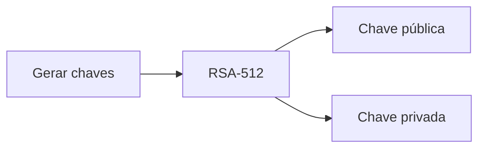
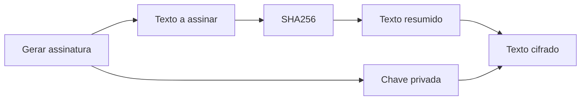
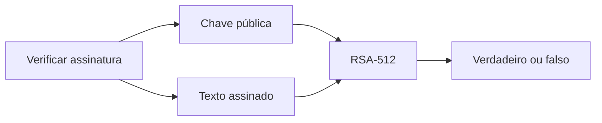

# Aula 7

## Assinatura Digital

### Esquema de assinatura digital
Recorrendo a chaves públicas (nomeadamente RSA), são usados **três** algoritmos:

- Algoritmo para gerar chaves: É gerado um par de chaves, uma pública e outra privada;
  - (pub, priv) = RSA(512);

- Algoritmo para gerar assinatura: É calculado o Hash da mensagem e decifrado com a chave privada;
  - Texto Assinado = RSA(priv, SHA256(Mensagem));

- Algoritmo para verificar assinatura: É calculado o Hash da mensagem e decifrado com a chave pública;
  - Verifica = RSA(pub, SHA256(Mensagem)) == Texto Assinado;

### Propriedades principais de uma assinatura digital
Estas são as **cinco principais propriedades** de uma assinatura digital:
  - Autenticidade: A mensagem foi assinada pelo dono da chave privada;
  - Autenticação da origem de informação: A assinatura digital é única para cada mensagem;
  - Integridade dos dados: Qualquer alteração na mensagem invalida a assinatura;
  - Dificuldade de falsificação: É difícil falsificar uma assinatura digital;
  - Garantia de não repúdio: O dono da chave privada não pode negar que assinou a mensagem.

### OAEP (Optimal Asymmetric Encryption Padding)

### Proof of Existence (POE)

